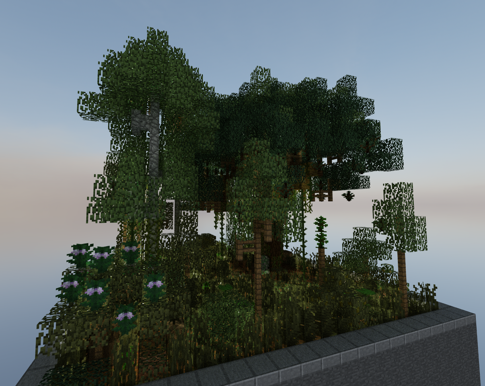

CUDA Path Tracer
================

**University of Pennsylvania, CIS 565: GPU Programming and Architecture, Project 3**

* Raymond Feng
  * [LinkedIn](https://www.linkedin.com/in/raymond-ma-feng/), [personal website](https://www.rfeng.dev/)
* Tested on: Windows 11, i9-9900KF @ 3.60GHz 32GB, NVIDIA GeForce RTX 2070 SUPER (Personal Computer)

## Core Features
- Stream Compaction
- BSDF evaluation for diffuse and perfectly specular surfaces
- Stochastic sampled anti aliasing
- Material sorting

## Additional Features
**Visual Improvements**
- (2) refractive materials (glass)
- (5) texture mapping (albedo + normals)
- (2) Environment maps

**Mesh Improvements**
- (4) GLTF loading

**Performance Improvements**
- (1) Russian roulette path termination
- (6) BVH structure

**SOURCES:**
- pbr textbook
- https://www.scratchapixel.com/lessons/3d-basic-rendering/ray-tracing-rendering-a-triangle/moller-trumbore-ray-triangle-intersection.html
- https://tavianator.com/2022/ray_box_boundary.html
- https://jacco.ompf2.com/2022/04/13/how-to-build-a-bvh-part-1-basics/
- https://www.khronos.org/files/gltf20-reference-guide.pdf
